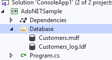
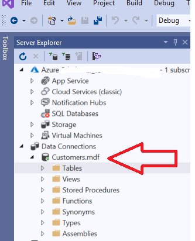
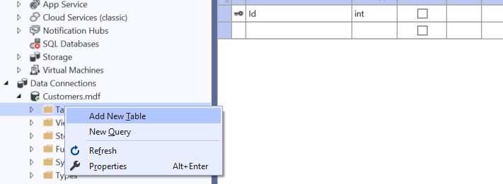
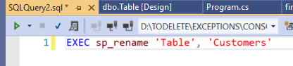
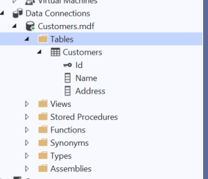
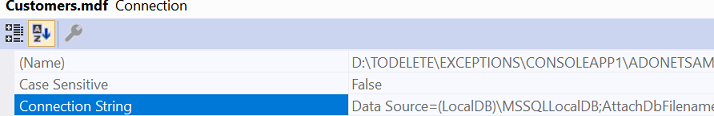

# ADO.NET and EF Core

## Purpose
The purpose of the task: to get a practical experience on how to work with ADO.NET to connect and store the applicatin data in the MS SQL local database. You will learn how to create a sample database using Visual Studio 2019, how to expolore and update properties of the database by using VS Server Explorer. You will also learn how to store the connection string in the appsetting.json configuration file. You will also learn how to read, update and delete data from the database tables using ADO.NET classes.

Estimated time to complete: 3 hours.   

Task status: mandatory / Manually-checked.   

## Description
1. Clone a skeleton solution from the repository provided by AutoCode
1. Create a new project and add to the solution. Use the `Console App (.NET Core)`  VS 2019 project type
1. Create `Folder Database`
1. Select folder in `Solution` explorer and Add Database `Customers`:  
    
     

1. You should get
   
       

1. Open `VS Server Explorer` and see your database in the server view
  
    

1. Add `Customers` Table to the `Customers.mdf` database

    

1. Rename the default name `Table` to `Customers` by running script

    

1. Refresh the Server Explorer View and make sure you got the database table renamed

    

1. Select `Customers.mdf` in Server Explorer view, open `Properties` window and copy a connection string to the database

    
